# Architecture — `roboflow-inference`

> Auto-generated by `repo-archaeologist`. Heuristic; treat as a starting map, not ground truth.

## Tech Stack

| Language | LOC | Share |
|---|---:|---:|
| Python | 635,446 | 99.0% |
| Shell | 1,547 | 0.2% |
| TypeScript | 1,409 | 0.2% |
| HTML | 1,004 | 0.2% |
| CSS | 941 | 0.1% |
| C++ | 660 | 0.1% |
| JavaScript | 573 | 0.1% |
| Other | 61 | 0.0% |

**Total source LOC:** 641,641 across 2923 source files (3781 files total).

## Entry Points

- `setup.py`

## Dependencies

_No dependency manifests detected (no requirements.txt, pyproject.toml, package.json, go.mod, Cargo.toml, or Gemfile)._

## Top-Level Layout

```
roboflow-inference/
- .claude/
- .cursor/
- .release/  (6 source files)
- app_bundles/  (10 source files)
- build_scripts/  (2 source files)
- development/  (57 source files)
- docker/  (32 source files)
- docs/  (9 source files)
- examples/  (26 source files)
- inference/  (1188 source files)
- inference_cli/  (67 source files)
- inference_models/  (539 source files)
- inference_sdk/  (31 source files)
- modal/  (3 source files)
- requirements/
- signatures/
- tests/  (941 source files)
- theme/  (8 source files)
- theme_build/  (1 source files)
- .actrc
- .dockerignore
- .isort.cfg
- AGENTS.md
- CITATION.cff
- CODEOWNERS
- CONTRIBUTING.md
- LICENSE
- LICENSE.core
- Makefile
- README.md
- banner.png
- debugrun.py
- mkdocs.yml
- pyproject.toml
- pytest.ini
- setup.py
- uv.lock
```

## Module Breakdown

| Directory | Source files |
|---|---:|
| inference | 1188 |
| tests | 941 |
| inference_models | 539 |
| inference_cli | 67 |
| development | 57 |
| docker | 32 |
| inference_sdk | 31 |
| examples | 26 |
| app_bundles | 10 |
| docs | 9 |
| theme | 8 |
| .release | 6 |
| modal | 3 |
| build_scripts | 2 |
| Makefile | 1 |

## Dependency Diagram

_Best-effort module dependency graph from static imports. Local modules only; external dependencies are collapsed._

```mermaid
graph LR
  inference_core_workflows_execution_engine_entities_base["inference.core.workflows.execution_engine.entities.base"]
  inference_core_workflows_prototypes_block["inference.core.workflows.prototypes.block"]
  inference_core_env["inference.core.env"]
  inference_core_workflows_execution_engine_entities_types["inference.core.workflows.execution_engine.entities.types"]
  inference_core_workflows_core_steps_loader["inference.core.workflows.core_steps.loader"]
  inference_core_managers_base["inference.core.managers.base"]
  inference_core_workflows_core_steps_common_entities["inference.core.workflows.core_steps.common.entities"]
  inference_core_workflows_execution_engine_constants["inference.core.workflows.execution_engine.constants"]
  inference_core_workflows_execution_engine_core["inference.core.workflows.execution_engine.core"]
  inference_core_roboflow_api["inference.core.roboflow_api"]
  inference_core_workflows_execution_engine_entities_tensor_native_types["inference.core.workflows.execution_engine.entities.tensor_native_types"]
  inference_core_workflows_core_steps_common_tensor_native["inference.core.workflows.core_steps.common.tensor_native"]
  inference_core_workflows_errors["inference.core.workflows.errors"]
  inference_core_utils_image_utils["inference.core.utils.image_utils"]
  inference_core_workflows_core_steps_common_utils["inference.core.workflows.core_steps.common.utils"]
  inference_core_entities_requests_inference["inference.core.entities.requests.inference"]
  inference_core_exceptions["inference.core.exceptions"]
  inference_core_interfaces_http_http_api["inference.core.interfaces.http.http_api"]
  inference_core_entities_responses_inference["inference.core.entities.responses.inference"]
  inference_models_utils["inference.models.utils"]
  tests_workflows_integration_tests_execution_workflows_gallery_collector_decorators["tests.workflows.integration_tests.execution.workflows_gallery_collector.decorators"]
  inference_core_workflows_core_steps_visualizations_common_base["inference.core.workflows.core_steps.visualizations.common.base"]
  inference_core_logger["inference.core.logger"]
  inference_core_registries_roboflow["inference.core.registries.roboflow"]
  inference_core_interfaces_camera_entities["inference.core.interfaces.camera.entities"]
  inference_core_interfaces_stream_inference_pipeline["inference.core.interfaces.stream.inference_pipeline"]
  inference_core_models_base["inference.core.models.base"]
  inference_core_models_roboflow["inference.core.models.roboflow"]
  inference_core_workflows_core_steps_common_query_language_operations_core["inference.core.workflows.core_steps.common.query_language.operations.core"]
  inference_core_workflows_execution_engine_v1_compiler_entities["inference.core.workflows.execution_engine.v1.compiler.entities"]
  inference_core_workflows_core_steps_visualizations_common_base_tensor["inference.core.workflows.core_steps.visualizations.common.base_tensor"]
  inference_core_interfaces_camera_video_source["inference.core.interfaces.camera.video_source"]
  inference_core_workflows_core_steps_common_query_language_entities_operations["inference.core.workflows.core_steps.common.query_language.entities.operations"]
  inference_core_models_types["inference.core.models.types"]
  inference_sdk_config["inference_sdk.config"]
  inference_core_workflows_execution_engine_v1_compiler_core["inference.core.workflows.execution_engine.v1.compiler.core"]
  inference_core_utils_postprocess["inference.core.utils.postprocess"]
  inference_core_workflows_core_steps_common_query_language_errors["inference.core.workflows.core_steps.common.query_language.errors"]
  inference_core_workflows_execution_engine_introspection_blocks_loader["inference.core.workflows.execution_engine.introspection.blocks_loader"]
  inference_core_workflows_core_steps_sinks_noop["inference.core.workflows.core_steps.sinks.noop"]
  ext["external deps"]
  inference_core_workflows_execution_engine_entities_base -.-> ext
  inference_core_workflows_prototypes_block -.-> ext
  inference_core_env -.-> ext
  inference_core_workflows_execution_engine_entities_types -.-> ext
  inference_core_workflows_core_steps_loader -.-> ext
  inference_core_interfaces_camera_video_source --> inference_core_env
  inference_core_interfaces_camera_video_source --> inference_core_interfaces_camera_entities
  inference_core_interfaces_http_http_api --> inference_core_entities_requests_inference
  inference_core_interfaces_http_http_api --> inference_core_entities_responses_inference
  inference_core_interfaces_http_http_api --> inference_core_env
  inference_core_interfaces_http_http_api --> inference_core_exceptions
  inference_core_interfaces_http_http_api --> inference_core_managers_base
  inference_core_interfaces_http_http_api --> inference_core_roboflow_api
  inference_core_interfaces_http_http_api --> inference_core_workflows_core_steps_common_entities
  inference_core_interfaces_http_http_api --> inference_core_workflows_errors
  inference_core_interfaces_http_http_api --> inference_core_workflows_execution_engine_core
  inference_core_interfaces_http_http_api --> inference_core_workflows_execution_engine_entities_base
  inference_core_interfaces_http_http_api --> inference_core_workflows_execution_engine_introspection_blocks_loader
  inference_core_interfaces_http_http_api --> inference_sdk_config
  inference_core_interfaces_stream_inference_pipeline --> inference_core_env
  inference_core_interfaces_stream_inference_pipeline --> inference_core_exceptions
  inference_core_interfaces_stream_inference_pipeline --> inference_core_interfaces_camera_entities
  inference_core_interfaces_stream_inference_pipeline --> inference_core_interfaces_camera_video_source
  inference_core_interfaces_stream_inference_pipeline --> inference_core_managers_base
  inference_core_interfaces_stream_inference_pipeline --> inference_core_registries_roboflow
  inference_core_interfaces_stream_inference_pipeline --> inference_core_roboflow_api
  inference_core_interfaces_stream_inference_pipeline --> inference_core_workflows_core_steps_common_entities
  inference_core_interfaces_stream_inference_pipeline --> inference_core_workflows_execution_engine_core
  inference_core_interfaces_stream_inference_pipeline --> inference_models_utils
  inference_core_logger --> inference_core_env
  inference_core_logger --> inference_sdk_config
  inference_core_managers_base --> inference_core_entities_requests_inference
  inference_core_managers_base --> inference_core_entities_responses_inference
  inference_core_managers_base --> inference_core_env
  inference_core_managers_base --> inference_core_exceptions
  inference_core_managers_base --> inference_core_logger
  inference_core_managers_base --> inference_core_models_base
  inference_core_managers_base --> inference_core_registries_roboflow
  inference_core_models_base --> inference_core_entities_requests_inference
  inference_core_models_base --> inference_core_entities_responses_inference
  inference_core_models_base --> inference_core_env
  inference_core_models_base --> inference_core_models_types
  inference_core_models_roboflow --> inference_core_entities_requests_inference
  inference_core_models_roboflow --> inference_core_entities_responses_inference
  inference_core_models_roboflow --> inference_core_env
  inference_core_models_roboflow --> inference_core_exceptions
  inference_core_models_roboflow --> inference_core_logger
  inference_core_models_roboflow --> inference_core_models_base
  inference_core_models_roboflow --> inference_core_registries_roboflow
  inference_core_models_roboflow --> inference_core_roboflow_api
  inference_core_models_roboflow --> inference_core_utils_image_utils
  inference_core_registries_roboflow --> inference_core_env
  inference_core_registries_roboflow --> inference_core_exceptions
  inference_core_registries_roboflow --> inference_core_logger
  inference_core_registries_roboflow --> inference_core_models_base
  inference_core_registries_roboflow --> inference_core_roboflow_api
  inference_core_roboflow_api --> inference_core_env
  inference_core_roboflow_api --> inference_core_exceptions
  inference_core_utils_image_utils --> inference_core_entities_requests_inference
  inference_core_utils_image_utils --> inference_core_env
  inference_core_utils_image_utils --> inference_core_exceptions
  inference_core_utils_postprocess --> inference_core_exceptions
  inference_core_workflows_core_steps_common_entities --> inference_core_workflows_prototypes_block
  inference_core_workflows_core_steps_common_query_language_entities_operations --> inference_core_workflows_execution_engine_entities_types
  inference_core_workflows_core_steps_common_query_language_errors --> inference_core_workflows_errors
  inference_core_workflows_core_steps_common_query_language_operations_core --> inference_core_workflows_core_steps_common_query_language_entities_operations
  inference_core_workflows_core_steps_common_query_language_operations_core --> inference_core_workflows_core_steps_common_query_language_errors
  inference_core_workflows_core_steps_common_tensor_native --> inference_core_env
  inference_core_workflows_core_steps_common_tensor_native --> inference_core_workflows_execution_engine_constants
  inference_core_workflows_core_steps_common_tensor_native --> inference_core_workflows_execution_engine_entities_base
  inference_core_workflows_core_steps_common_utils --> inference_core_managers_base
  inference_core_workflows_core_steps_common_utils --> inference_core_roboflow_api
  inference_core_workflows_core_steps_common_utils --> inference_core_workflows_execution_engine_constants
  inference_core_workflows_core_steps_common_utils --> inference_core_workflows_execution_engine_entities_base
  inference_core_workflows_core_steps_common_utils --> inference_core_workflows_prototypes_block
  inference_core_workflows_core_steps_common_utils --> inference_sdk_config
  inference_core_workflows_core_steps_loader --> inference_core_env
  inference_core_workflows_core_steps_loader --> inference_core_workflows_core_steps_common_entities
  inference_core_workflows_core_steps_loader --> inference_core_workflows_execution_engine_entities_tensor_native_types
  inference_core_workflows_core_steps_loader --> inference_core_workflows_execution_engine_entities_types
  inference_core_workflows_core_steps_loader --> inference_core_workflows_prototypes_block
  inference_core_workflows_core_steps_sinks_noop --> inference_core_workflows_prototypes_block
  inference_core_workflows_core_steps_visualizations_common_base --> inference_core_workflows_execution_engine_entities_base
  inference_core_workflows_core_steps_visualizations_common_base --> inference_core_workflows_execution_engine_entities_types
  inference_core_workflows_core_steps_visualizations_common_base --> inference_core_workflows_prototypes_block
  inference_core_workflows_core_steps_visualizations_common_base_tensor --> inference_core_workflows_core_steps_common_tensor_native
  inference_core_workflows_core_steps_visualizations_common_base_tensor --> inference_core_workflows_execution_engine_constants
  inference_core_workflows_core_steps_visualizations_common_base_tensor --> inference_core_workflows_execution_engine_entities_base
  inference_core_workflows_core_steps_visualizations_common_base_tensor --> inference_core_workflows_execution_engine_entities_tensor_native_types
  inference_core_workflows_core_steps_visualizations_common_base_tensor --> inference_core_workflows_execution_engine_entities_types
  inference_core_workflows_core_steps_visualizations_common_base_tensor --> inference_core_workflows_prototypes_block
  inference_core_workflows_execution_engine_core --> inference_core_workflows_errors
  inference_core_workflows_execution_engine_entities_base --> inference_core_env
  inference_core_workflows_execution_engine_entities_base --> inference_core_utils_image_utils
  inference_core_workflows_execution_engine_entities_base --> inference_core_workflows_execution_engine_entities_types
  inference_core_workflows_execution_engine_entities_tensor_native_types --> inference_core_workflows_execution_engine_entities_types
  inference_core_workflows_execution_engine_introspection_blocks_loader --> inference_core_env
  inference_core_workflows_execution_engine_introspection_blocks_loader --> inference_core_workflows_core_steps_loader
  inference_core_workflows_execution_engine_introspection_blocks_loader --> inference_core_workflows_errors
  inference_core_workflows_execution_engine_introspection_blocks_loader --> inference_core_workflows_execution_engine_entities_types
  inference_core_workflows_execution_engine_introspection_blocks_loader --> inference_core_workflows_execution_engine_v1_compiler_entities
  inference_core_workflows_execution_engine_introspection_blocks_loader --> inference_core_workflows_prototypes_block
  inference_core_workflows_execution_engine_v1_compiler_core --> inference_core_workflows_execution_engine_entities_base
  inference_core_workflows_execution_engine_v1_compiler_core --> inference_core_workflows_execution_engine_introspection_blocks_loader
  inference_core_workflows_execution_engine_v1_compiler_core --> inference_core_workflows_execution_engine_v1_compiler_entities
  inference_core_workflows_execution_engine_v1_compiler_core --> inference_core_workflows_prototypes_block
  inference_core_workflows_execution_engine_v1_compiler_entities --> inference_core_workflows_execution_engine_entities_base
  inference_core_workflows_execution_engine_v1_compiler_entities --> inference_core_workflows_execution_engine_entities_types
  inference_core_workflows_execution_engine_v1_compiler_entities --> inference_core_workflows_prototypes_block
  inference_core_workflows_prototypes_block --> inference_core_workflows_errors
  inference_core_workflows_prototypes_block --> inference_core_workflows_execution_engine_entities_base
  inference_models_utils --> inference_core_env
  inference_models_utils --> inference_core_models_base
  inference_models_utils --> inference_core_registries_roboflow
```



## Dead Code Estimate

**391 module(s) appear unreferenced** out of 1290 candidate(s). These are source files no other file imports or requires. Verify before deleting — dynamic imports and entry points may not be detected.

| File | Language |
|---|---|
| `docs/javascript/cookbooks.js` | JavaScript |
| `docs/javascript/init_kapa_widget.js` | JavaScript |
| `docs/javascript/workflows.js` | JavaScript |
| `inference/landing/next.config.js` | JavaScript |
| `inference/landing/out/_next/static/chunks/0cz1d0mv5g_q7.js` | JavaScript |
| `inference/landing/out/_next/static/chunks/0m-25gihm54gk.js` | JavaScript |
| `inference/landing/out/_next/static/chunks/0oie-srt8oj81.js` | JavaScript |
| `inference/landing/out/_next/static/chunks/14mumt5_n0xhi.js` | JavaScript |
| `inference/landing/out/_next/static/chunks/199gys1a181qz.js` | JavaScript |
| `inference/landing/out/_next/static/chunks/1d4h-sglyo8ft.js` | JavaScript |
| `inference/landing/out/_next/static/chunks/1upe53-127sm4.js` | JavaScript |
| `inference/landing/out/_next/static/chunks/33g7_zjejejur.js` | JavaScript |
| `inference/landing/out/_next/static/chunks/3tdt82gkfdvr-.js` | JavaScript |
| `inference/landing/out/_next/static/chunks/turbopack-1683dnhgl6y0y.js` | JavaScript |
| `inference/landing/out/_next/static/sVTHpt9ZgBRC0D4VeDv9c/_buildManifest.js` | JavaScript |
| `inference/landing/out/_next/static/sVTHpt9ZgBRC0D4VeDv9c/_clientMiddlewareManifest.js` | JavaScript |
| `inference/landing/out/_next/static/sVTHpt9ZgBRC0D4VeDv9c/_ssgManifest.js` | JavaScript |
| `inference/landing/postcss.config.js` | JavaScript |
| `inference/landing/src/app/components/Examples.tsx` | JavaScript |
| `inference/landing/src/app/dashboard/page.tsx` | JavaScript |
| `inference/landing/src/app/layout.tsx` | JavaScript |
| `inference/landing/src/app/notebook-instructions/page.tsx` | JavaScript |
| `inference/landing/src/app/page.tsx` | JavaScript |
| `inference/landing/tailwind.config.ts` | JavaScript |
| `theme/assets/home.js` | JavaScript |
| `theme/js/segment.js` | JavaScript |
| `theme_build/tailwind.config.js` | JavaScript |
| `.release/pypi/inference.cli.setup.py` | Python |
| `.release/pypi/inference.core.setup.py` | Python |
| `.release/pypi/inference.cpu.setup.py` | Python |
| `.release/pypi/inference.gpu.setup.py` | Python |
| `.release/pypi/inference.sdk.setup.py` | Python |
| `.release/pypi/inference.setup.py` | Python |
| `app_bundles/osx/build.py` | Python |
| `app_bundles/osx/cpu_http.py` | Python |
| `app_bundles/osx/hooks/hook-inference.models.py` | Python |
| `app_bundles/osx/openssl_audit.py` | Python |
| `app_bundles/osx/run_inference.py` | Python |
| `app_bundles/windows/build.py` | Python |
| `app_bundles/windows/cpu_http.py` | Python |
| `app_bundles/windows/hooks/hook-inference.models.py` | Python |
| `app_bundles/windows/run_inference.py` | Python |
| `debugrun.py` | Python |
| `development/benchmark_scripts/benchmark_owlv2_inference_time.py` | Python |
| `development/benchmark_scripts/benchmark_remote_http_session_reuse.py` | Python |
| `development/benchmarks/semantic_segmentation/benchmark_postprocessing.py` | Python |
| `development/benchmarks/semantic_segmentation/check_output_parity.py` | Python |
| `development/docs/check_redirect_destinations.py` | Python |
| `development/docs/validate_docs_jinja2.py` | Python |
| `development/docs/workflows_gallery_builder.py` | Python |

_…and 341 more._

## Largest Source Files

| File | LOC |
|---|---:|
| inference_models/tests/unit_tests/models/common/roboflow/test_pre_processing.py | 9,289 |
| inference_models/tests/integration_tests/models/test_yolov8_keypoints_detection_predictions_onnx.py | 7,639 |
| inference_models/tests/unit_tests/models/auto_loaders/test_core.py | 5,801 |
| tests/inference/unit_tests/core/test_roboflow_api.py | 4,840 |
| inference_models/inference_models/models/auto_loaders/core.py | 4,698 |
| inference_models/tests/integration_tests/models/test_yolov8_keypoints_detection_predictions_torch.py | 4,285 |
| tests/inference_sdk/unit_tests/http/test_client.py | 4,285 |
| inference/core/interfaces/http/http_api.py | 4,280 |
| tests/workflows/integration_tests/execution/test_plugins_enforcing_scalars_to_fit_into_batch_parameters.py | 4,264 |
| inference_models/tests/unit_tests/models/auto_loaders/test_auto_negotiation.py | 3,913 |

## Project Hygiene

| Signal | Status |
|---|---|
| README | present |
| LICENSE | present |
| CI config | present |
| Dockerfile | absent |
| Lockfile | present |
| Tests | detected |
